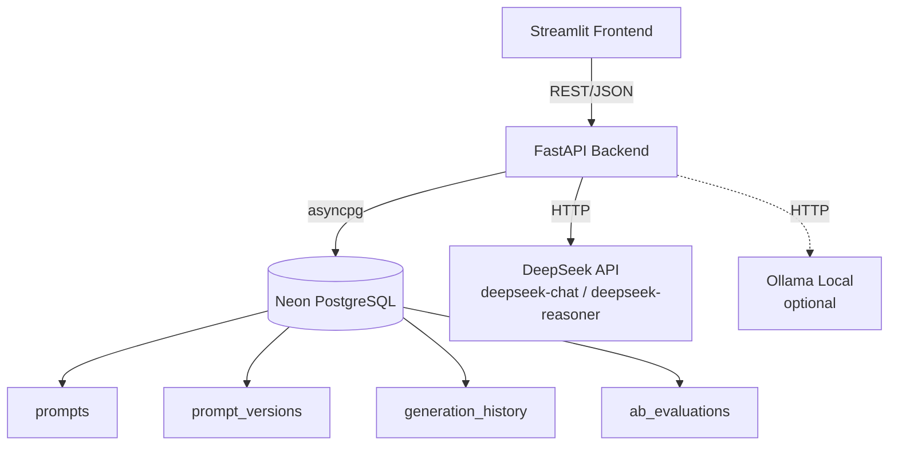

# 🧪 PromptLab — Prompt Engineering Workbench

> **Systematically engineer, test, version, and compare prompts across LLMs with Git-like history and A/B evaluations.**

[](https://python.org)
[](https://fastapi.tiangolo.com)
[](https://streamlit.io)
[](LICENSE)
[](https://promptlab-7pjkcx83u5plw8ngnmwwuf.streamlit.app)

---

## 🏗 Architecture



---

## ✨ Features

- 📝 **Prompt Editor** — Code-mirror-style text area with variable `{{highlighting}}`, live preview, and template loading
- ⚡ **Multi-LLM Comparison** — Send prompts to DeepSeek Chat, DeepSeek Reasoner, and local Ollama models simultaneously; view side-by-side outputs
- ⚖️ **A/B Evaluation** — Compare two prompts head-to-head, rate on relevance/accuracy/creativity (1–5), track scores over time with trend charts
- 🕰 **Prompt Versioning** — Git-like history: every save creates a version, view diffs, rollback to any previous version
- 📚 **Prompt Library** — 21 pre-built templates across 7 categories: summarization, code generation, creative writing, classification, RAG Q&A, chain-of-thought, few-shot
- 💰 **Cost & Latency Tracking** — Token counts, cost estimates, and latency recorded for every generation with per-model breakdowns
- 📊 **Analytics Dashboard** — Aggregate cost metrics, latency scatter plots, and evaluation score trends
- 📤 **Export/Import** — Export prompts as JSON or Markdown, import to recreate

---

## 🚀 Quick Start

### Prerequisites

- **Python 3.11+** installed
- **DeepSeek API key** — [Get one here](https://platform.deepseek.com)
- **Neon PostgreSQL database** — [Create free database](https://console.neon.tech)
- (Optional) **Ollama** for local models — [Install Ollama](https://ollama.com)

### 1. Clone & Setup

```bash
cd promptlab

# Copy and edit environment variables
cp .env.example .env
# Edit .env with your DeepSeek key and Neon credentials
```

### 2. Install Dependencies

```bash
# Backend
cd backend
pip install -r requirements.txt

# Frontend
cd ../frontend
pip install -r requirements.txt
```

### 3. Run

**Option A: One-click (Windows)**
```bash
run.bat
```

**Option B: Manual**
```bash
# Terminal 1 — Backend API
cd backend
python main.py

# Terminal 2 — Frontend
cd frontend
streamlit run app.py
```

### 4. Open

| Service | URL |
|---------|-----|
| Frontend | http://localhost:8501 |
| API Docs (Swagger) | http://127.0.0.1:8000/docs |
| API Health | http://127.0.0.1:8000/health |

---

## 🔧 Environment Variables

| Variable | Required | Default | Description |
|----------|----------|---------|-------------|
| `DEEPSEEK_API_KEY` | **Yes** | — | Your DeepSeek API key |
| `NEON_HOST` | **Yes** | — | Neon PostgreSQL hostname |
| `NEON_DATABASE` | **Yes** | — | Database name |
| `NEON_USER` | **Yes** | — | Database user |
| `NEON_PASSWORD` | **Yes** | — | Database password |
| `DATABASE_URL` | No | — | Full connection string (overrides individual Neon fields) |
| `HOST` | No | `127.0.0.1` | API server host |
| `PORT` | No | `8000` | API server port |
| `OLLAMA_ENABLED` | No | `true` | Enable Ollama local model integration |
| `OLLAMA_BASE_URL` | No | `http://localhost:11434` | Ollama server URL |

---

## 📁 Project Structure

```
promptlab/
├── backend/
│   ├── main.py              # FastAPI app with all endpoints
│   ├── config.py            # Environment config & constants
│   ├── models.py            # Pydantic request/response schemas
│   ├── database.py          # Neon PostgreSQL async operations
│   ├── llm_service.py       # DeepSeek + Ollama API integration
│   ├── prompt_manager.py    # Template library, diffs, export/import
│   ├── eval_service.py      # A/B evaluation logic
│   └── requirements.txt
├── frontend/
│   ├── app.py               # Streamlit UI (5 tabs)
│   └── requirements.txt
├── prompts/                 # Built-in template library
│   ├── summarization.json
│   ├── code_generation.json
│   ├── creative_writing.json
│   ├── classification.json
│   ├── rag_qa.json
│   ├── chain_of_thought.json
│   └── few_shot.json
├── .env.example
├── .gitignore
├── run.bat
└── README.md
```

---

## 🎯 Usage Guide

### Prompt Editor Tab
1. Write a prompt with `{{variables}}` — they auto-detect and show input fields
2. Select LLM backends (DeepSeek Chat, Reasoner, or Ollama models)
3. Set temperature and max tokens
4. Click **Generate** — outputs appear side-by-side with cost/latency
5. Click **Save** to persist and create a new version

### Compare (A/B) Tab
1. Select two different prompts
2. Fill in variables for each
3. Click **Run A/B Comparison** — both generate simultaneously
4. Rate each output on Relevance, Accuracy, Creativity (1–5)
5. Click **Submit Evaluation** — scores persist and appear in analytics

### Library Tab
- Browse 21 templates across 7 categories
- Preview any template with highlighted variables
- One-click **Use This** to load into the Editor

### History Tab
- Searchable log of all generations
- Filter by prompt name and model
- Expand to see full output, token counts, and variables used

### Analytics Tab
- Aggregate cost metrics (total generations, tokens, spend)
- Per-model cost breakdown table
- Evaluation score trends line chart
- Latency scatter plot over time

---

## 💰 Cost Estimates

PromptLab tracks costs using these rates (per 1M tokens):

| Model | Input | Output |
|-------|-------|--------|
| DeepSeek Chat (V3) | $0.14 | $0.28 |
| DeepSeek Reasoner (R1) | $0.55 | $2.19 |
| Ollama (local) | Free | Free |

---

## 📸 Screenshots

> *Screenshot placeholders — replace with actual screenshots*

| Editor | A/B Compare | Analytics |
|--------|-------------|-----------|
|  |  |  |

---

## 🧪 Deploy to Vercel (Frontend)

The Streamlit frontend can be deployed to Vercel as a static app using the Streamlit Community Cloud or by running in a container. For Vercel free tier:

```bash
# Add vercel.json to root
{
  "builds": [{"src": "frontend/app.py", "use": "@vercel/python"}],
  "routes": [{"src": "/(.*)", "dest": "frontend/app.py"}]
}
```

**Note:** The backend must be hosted separately (e.g., Railway, Render, or a VPS) since Vercel's serverless functions have timeouts unsuitable for LLM calls.

---

## 📄 License

MIT © 2025 PromptLab

---

Built for prompt engineers who demand rigor. 🧪
